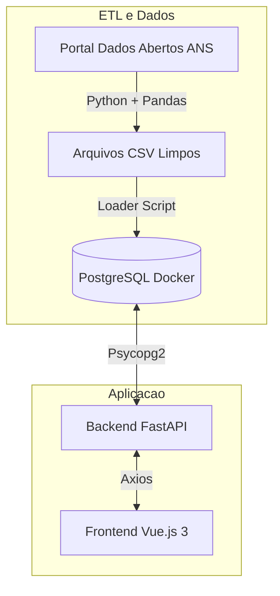

# Dashboard de Análise Financeira - Operadoras de Saúde (ANS)

> Teste Técnico para Estágio em Desenvolvimento de Software - IntuitiveCare

Este projeto é uma solução Full Stack para extração, transformação, carregamento e visualização de dados financeiros de Operadoras de Planos de Saúde, utilizando dados abertos da ANS (Agência Nacional de Saúde Suplementar).

---

## Arquitetura do Projeto

O sistema foi desenvolvido seguindo uma arquitetura modular baseada em 4 Pilares, garantindo separação de responsabilidades e facilidade de manutenção.



### Tecnologias Utilizadas

| Camada             | Tecnologia              | Motivação da Escolha                                                                    |
| ------------------ | ----------------------- | --------------------------------------------------------------------------------------- |
| **Banco de Dados** | **PostgreSQL (Docker)** | Robustez, suporte a queries complexas e facilidade de setup via container.              |
| **ETL**            | **Python (Pandas)**     | Melhor ferramenta de mercado para manipulação de dados e tratamento de encodings/erros. |
| **Backend**        | **FastAPI**             | Alta performance (async), documentação automática (Swagger) e sintaxe moderna.          |
| **Frontend**       | **Vue.js 3 + Vite**     | Curva de aprendizado rápida, reatividade performática e build otimizado.                |
| **Visualização**   | **Chart.js**            | Biblioteca leve e flexível para renderização de gráficos interativos.                   |

---

## Como Rodar o Projeto

### Pré-requisitos

- Docker e Docker Compose
- Python 3.8+
- Node.js 16+

### Passo 1: Infraestrutura (Banco de Dados)

Inicie o container do PostgreSQL. O script `init.sql` criará automaticamente as tabelas necessárias.

```bash
docker-compose up -d

```

### Passo 2: ETL (Carga de Dados)

Execute os scripts para baixar os dados da ANS, tratar inconsistências (como encoding latin1) e popular o banco.

```bash
# Instale as dependências Python
pip install pandas requests psycopg2-binary fastapi uvicorn

# 1. Baixar e tratar os arquivos (Gera CSVs na pasta etl/)
python3 etl/main_etl.py

# 2. Carregar os CSVs para o Banco de Dados
python3 etl/loader.py

```

### Passo 3: Backend (API)

Inicie o servidor da API.

```bash
uvicorn backend.main:app --reload

```

- **Documentação da API:** Acesse `http://localhost:8000/docs` para ver o Swagger UI.

### Passo 4: Frontend (Interface)

Em um novo terminal, inicie a aplicação Vue.js.

```bash
cd frontend
npm install
npm run dev

```

- **Acesse o Dashboard:** Abra `http://localhost:5173/` no seu navegador.

---

## Funcionalidades Implementadas

1. **Dashboard Financeiro:**

- Visualização do Total Geral de Despesas (Eventos/Sinistros).
- Gráfico de Barras: Top 5 Estados com maiores despesas.
- Lista: Top 5 Operadoras com maiores gastos no último trimestre.

2. **Busca de Operadoras:**

- Listagem paginada de todas as operadoras ativas.
- **Busca Textual:** Filtro dinâmico por Razão Social ou CNPJ.

3. **Detalhe da Operadora:**

- Visualização de dados cadastrais (Registro ANS, Endereço, Modalidade).
- **Histórico Financeiro:** Gráfico de linha mostrando a evolução das despesas (trimestre a trimestre).

---

## Decisões de Design e Trade-offs

- **FastAPI vs Flask:** Optei pelo FastAPI devido à sua validação de dados nativa (Pydantic) e geração automática de documentação, o que acelerou o desenvolvimento e facilita testes.
- **ETL em Python vs SQL Puro:** O tratamento dos arquivos da ANS exigiu lógica complexa de limpeza (erros de encoding, colunas renomeadas), o que seria inviável fazer apenas com SQL. O Pandas ofereceu a flexibilidade necessária.
- **Paginação no Backend:** Para garantir performance, a paginação é feita diretamente na query SQL (LIMIT/OFFSET), evitando trafegar milhares de registros desnecessários para o frontend.

---

**Desenvolvido por Matteo**

```

```
